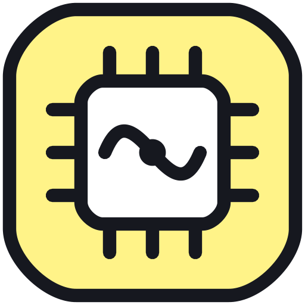

<div align="center">



# ECE MAKAUT Short Notes

### Complete Exam-Ready Academic Notes & Combined Archives for MAKAUT B.Tech ECE (2023–27)

[](https://github.com/Biraj2004/ECE_MAKAUT_Short-Notes)
[](#status)
[](#status)
[](#status)
[](#status)
[](LICENSE)

[](https://biraj2004.github.io/ECE_MAKAUT_Short-Notes/)
[](Notes_Build_Guide.md)
[](pdf_secure.py)

<br/>

**Curated, structured & compiled in XeLaTeX by [Biraj Sarkar](https://iambiraj.vercel.app)**  
*Department of Electronics & Communication Engineering, Cooch Behar Government Engineering College (CGEC)*

[🌐 Web Showcase Portal](https://biraj2004.github.io/ECE_MAKAUT_Short-Notes/) • [👨‍💻 Developer Portfolio](https://iambiraj.vercel.app) • [📚 MAKAUT PYQ Papers](https://docs.google.com/document/d/1NLcByiSlAugGMJxNbXkBvEaA9jEwVhUt-21GkwoT_ZE/edit?tab=t.0#heading=h.vpuhncm2s6km) • [📖 Style Guide](Notes_Build_Guide.md)

</div>

---

Every topic follows: **Definition → Concept → Working → Formula → Diagram → Advantages/Disadvantages → Applications → Exam Points**

---

## Status

| Semester | Status | Subjects | Official Syllabus |
|---|---|---|---|
| 1st SEM | ✅ Complete | 2 subjects (12 modules) | [`SEM-1 ECE_MAKAUT_SYLLABUS.pdf`](1st%20SEM/SEM-1%20ECE_MAKAUT_SYLLABUS.pdf) |
| 2nd SEM | ✅ Complete | 2 subjects (12 modules) | [`SEM-2 ECE_MAKAUT_SYLLABUS.pdf`](2nd%20SEM/SEM-2%20ECE_MAKAUT_SYLLABUS.pdf) |
| 3rd – 5th SEM | 🔲 Planned | — | Planned |
| 6th SEM | ✅ Complete | 10 subjects (55 modules) | [`SEM-6 ECE_MAKAUT_SYLLABUS.pdf`](6th%20SEM/SEM-6%20ECE_MAKAUT_SYLLABUS.pdf) |
| 7th SEM | ✅ Complete | 13 subjects (80 modules) | [`SEM-7 ECE_MAKAUT_SYLLABUS.pdf`](7th%20SEM/SEM-7%20ECE_MAKAUT_SYLLABUS.pdf) |
| 8th SEM | ✅ Complete | 12 subjects (63 modules) | [`SEM-8 ECE_MAKAUT_SYLLABUS.pdf`](8th%20SEM/SEM-8%20ECE_MAKAUT_SYLLABUS.pdf) |

> Every semester folder also includes a dedicated `New Syllabus Subjects/` subfolder reserved for new curriculum (NEP 2020) syllabus modules.

---

## 1st Semester

| Code | Subject | Modules |
|---|---|---|
| BS-CH101 | Chemistry-I | 7 |
| BS-PH101 | Physics-I | 5 |

---

## 2nd Semester

| Code | Subject | Modules |
|---|---|---|
| BS-CH101 | Chemistry-I | 7 |
| BS-PH101 | Physics-I | 5 |

---

## 6th Semester

| Code | Subject | Modules |
|---|---|---|
| EC601 | Control System | 7 |
| EC602 | Computer Network | 4 |
| HS-HU601 | Economics for Engineers | 4 |
| PE-EC603A | Introduction to MEMS | 4 |
| PE-EC603B | Bio-Medical Electronics | 4 |
| PE-EC603C | CMOS VLSI Design | 6 |
| PE-EC603D | Information Theory and Coding | 3 |
| OE-EC604A | Electronic Measurement and Measuring Instruments | 5 |
| OE-EC604B | Operating System | 9 |
| OE-EC604C | Object Oriented Programming | 9 |

---

## 7th Semester

| Code | Subject | Modules |
|---|---|---|
| HS-HU701 | Principles of Management | 4 |
| PE-EC701A | Microwave Theory and Technique | 9 |
| PE-EC701B | Satellite Communication | 6 |
| PE-EC701C | Mobile Communication and Networks | 6 |
| PE-EC702A | Adaptive Signal Processing | 5 |
| PE-EC702B | Digital Image and Video Processing | 8 |
| PE-EC702C | Neural Network and Fuzzy Logic Control | 5 |
| PE-EC703A | Embedded System | 5 |
| PE-EC703B | Wireless Sensor Networks | 5 |
| PE-EC703C | Wavelet Transforms | 7 |
| OE-EC704A | Web Technology | 10 |
| OE-EC704B | Optimization Technique | 6 |
| OE-EC704C | Entrepreneurship | 4 |

---

## 8th Semester

| Code | Subject | Modules |
|---|---|---|
| PE-EC801A | Antennas and Propagation | 7 |
| PE-EC801B | Fiber Optic Communication | 5 |
| PE-EC801C | Error Correcting Codes | 5 |
| PE-EC802A | Mixed Signal Design | 5 |
| PE-EC802B | Industrial Automation and Control | 5 |
| PE-EC802C | VLSI Design Automation | 5 |
| OE-EC803A | Internet of Things | 6 |
| OE-EC803B | Big Data Analysis | 6 |
| OE-EC803C | Cyber Security | 4 |
| OE-EC804A | Artificial Intelligence | 6 |
| OE-EC804B | Microwave Integrated Circuits | 5 |
| OE-EC804C | Organizational Behavior | 4 |

---

## Building PDFs

Requires **XeLaTeX** (TeX Live or MiKTeX) with fonts: `TeX Gyre Pagella`, `TeX Gyre Cursor`, `Latin Modern Math`.

```powershell
# Compile all module PDFs
.\pdf_compile.ps1

# Compile one subject
.\pdf_compile.ps1 -Subject "EC601"

# Compile a single file
.\pdf_compile.ps1 -Module "6th SEM\01. Control System\EC601_Module1_Notes.tex"

# Build combined PDFs (all subjects)
.\pdf_build_combined.ps1

# Build combined for one subject
.\pdf_build_combined.ps1 -Subject "EC602"

# Check security & metadata status across all PDFs:
python pdf_secure.py --check

# Secure and brand all PDFs across repository:
python pdf_secure.py --all
```

### PDF Security & Academic Metadata

All compiled PDFs are automatically post-processed by `pdf_secure.py` using **PyMuPDF AES-256 encryption**:
- **Zero Friction for Students:** No open password required — opens instantly in any browser or PDF reader.
- **Copying & Printing Allowed:** Content copying (formulas, code, definitions) and high-resolution printing are explicitly permitted.
- **Tamper Protection:** Document modifications and page extraction are restricted to preserve academic integrity and prevent unauthorized commercial re-bundling.
- **Standardized Metadata:** Injects uniform Title, Author attribution (`Biraj Sarkar (CGEC)`), Subject, Keywords, Creator link, and CC BY-NC-SA 4.0 license metadata.
- **Environment Configuration:** Permissions password is loaded from `.env` (template provided in `.env.example`).

### Cover Page Template

- [`Combined_Notes_Cover_Page.tex`](Combined_Notes_Cover_Page.tex): Standalone template used by `pdf_build_combined.ps1` to dynamically generate uniform cover pages for combined subject PDFs. It incorporates an elegant double-frame border, dynamic credit/department formatting (using `ECE`), and institutional association details. Preview available at [`Combined_Notes_Cover_Page.pdf`](Combined_Notes_Cover_Page.pdf).

---

## Formatting & Syllabus Standards

*   **100% Syllabus Alignment:** Every module is verified against the official MAKAUT ECE syllabus. Recent updates added missing topics in physical design (global routing algorithms), logic synthesis (technology-independent optimizations and Dagon's technology mapping), and high-level synthesis (FSMD hardware models and ILP binding formulations).
*   **Clean Word Spacing:** Standard justified `X` columns inside `tabularx` are replaced with left-aligned `Y` columns. Since word-breaking is globally disabled (`\hyphenpenalty=10000`), this ensures clean, natural spacing between words.
*   **Overlap-Free TikZ Diagrams:** TikZ graphs and flowcharts use isolated node styles for vertices, ensuring edge weight labels render as clean text without huge circle backgrounds overlapping lines.
*   **Table-to-Text Spacing:** Proactively uses `\par\vspace{6pt}\noindent` before tables and `\vspace{12pt}` before subsequent headings to prevent borders from colliding with text baselines.

---

## Tech stack

- **Compiler:** XeLaTeX
- **Diagrams:** TikZ
- **Boxes:** tcolorbox (`defbox`, `formulabox`, `examplebox`, `exambox`, `tikzbox`, `masonbox`)
- **Tables:** tabularx + booktabs
- **PDF Security & Metadata:** PyMuPDF (`pdf_secure.py` with AES-256 encryption)
- **Build Automation:** PowerShell (`pdf_compile.ps1`, `pdf_build_combined.ps1`)

See [`Notes_Build_Guide.md`](Notes_Build_Guide.md) for the full authoring spec.

---

## Web Portal

An interactive web showcase and PDF repository portal is hosted directly in [`docs/`](docs/) (deployable via GitHub Pages). It features:
- **Instant Background PDF Downloads:** 1-Click downloads open PDFs in a new tab without interrupting or navigating away from the active catalog view.
- **Standardized Syllabus Archive:** Direct access to official MAKAUT curriculum PDFs (`SEM-* ECE_MAKAUT_SYLLABUS.pdf`) for all completed semesters.
- **Fast Live Search & Filter:** Instant keyword filtering across all semesters, course codes, subjects, and complete syllabus topic lists in real-time.
- **Editorial Neo-Brutalism & Pastel UI:** High-contrast aesthetic with zero clutter, zero horizontal overflow across all screen sizes (desktop, tablet, mobile), and safe-area mobile bottom-sheet modals.
- **PWA & SEO Ready:** Includes `site.webmanifest`, `robots.txt`, `sitemap.xml`, high-res OpenGraph social preview assets (`og-image.png`, `og-thumb.png`), and smooth scroll-to-top interaction.

---

## External Resources & Credits

*   **Developer Portfolio ([iambiraj.vercel.app](https://iambiraj.vercel.app)):** Personal portfolio and software engineering showcase of [Biraj Sarkar](https://github.com/Biraj2004) (CGEC ECE '27) — creator, note author, and maintainer of this repository, automated LaTeX compilation pipelines, and web showcase portal.
*   **MAKAUT PYQ Papers Archive ([Google Document](https://docs.google.com/document/d/1NLcByiSlAugGMJxNbXkBvEaA9jEwVhUt-21GkwoT_ZE/edit?tab=t.0#heading=h.vpuhncm2s6km)):** Curated archive of MAKAUT Previous Year Questions (PYQs) across semesters, provided as an open academic resource to assist students with exam preparation.
*   **Academic Curriculum & Syllabus:** Official syllabus guidelines and course structures specified by the **Maulana Abul Kalam Azad University of Technology (MAKAUT), West Bengal** for the B.Tech in Electronics & Communication Engineering (AICTE model curriculum).
*   **Typography & Visual Assets:** Web showcase typography powered by [Outfit](https://fonts.google.com/specimen/Outfit), [Inter](https://fonts.google.com/specimen/Inter), and [Fira Code](https://fonts.google.com/specimen/Fira+Code) via Google Fonts. Modern vector iconography powered by [Lucide Icons](https://lucide.dev/).

---

## License & Attribution

Copyright (c) 2023–2027 **Biraj Sarkar**, Department of Electronics & Communication Engineering, Cooch Behar Government Engineering College (CGEC).

This project is licensed under the **[Creative Commons Attribution-NonCommercial-ShareAlike 4.0 International (CC BY-NC-SA 4.0)](LICENSE)** license.

> **Strict Non-Commercial Policy:** This repository and all derived materials (including LaTeX sources, compiled PDFs, diagrams, and notes) are provided **100% free of charge for students**. You are strictly prohibited from selling, packaging into paid courses, or monetizing these notes in any format (digital or physical). Any redistribution or remix must prominently credit **Biraj Sarkar (CGEC ECE)** and retain this identical license.

---

*Cooch Behar Government Engineering College · B.Tech ECE (2023–27) · MAKAUT*
